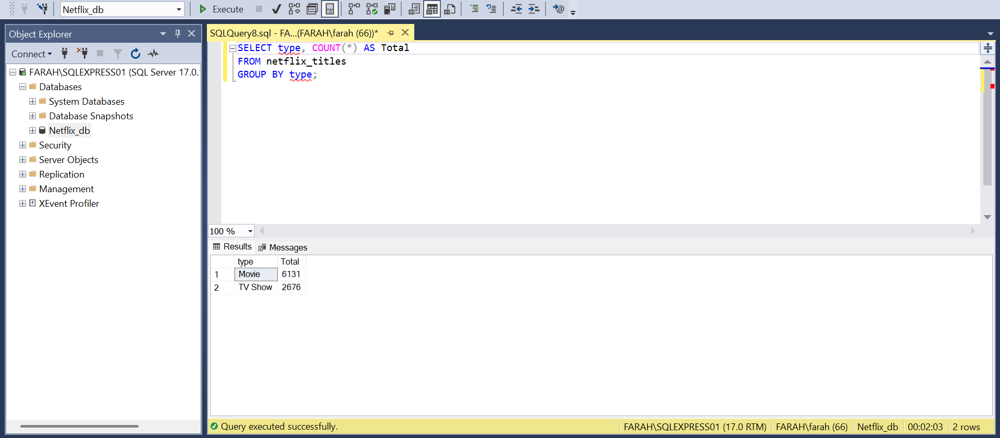
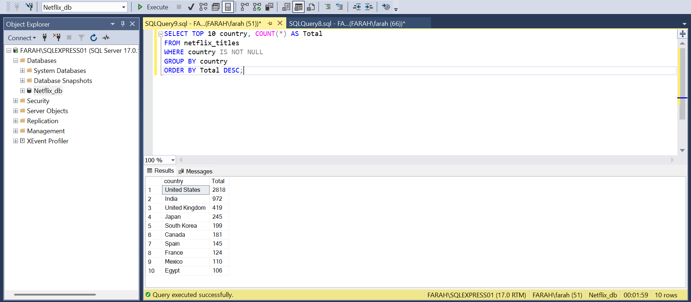
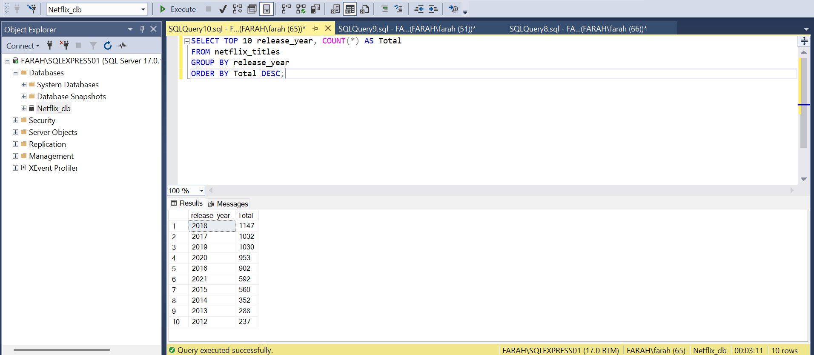

#  Netflix Data Analysis Project

##  Description
This project focuses on analyzing Netflix's global library using **SQL Server**. I performed the full data lifecycle: from **Data Ingestion** (including bulk data loading using BULK INSERT) to **Data Analysis** to uncover trends in movies and TV shows.

---

## Research Questions
In this analysis, I answered the following key questions:
* What is the distribution between **Movies vs. TV Shows**?
* Which **countries** are the top producers of Netflix content?
* How has **production evolved** over time (yearly trends)?

---

##  Tools Used
* **Microsoft SQL Server (SSMS):** For data storage, bulk loading, and advanced querying.
* **Google Sheets:** For initial data inspection and cleaning.
* **GitHub:** For project documentation and version control.

---

##  Key Insights
Based on the SQL queries, here are the main findings:
1.  **Content Variety:** There are significantly **more Movies than TV Shows** in the catalog.
2.  
3.  **Global Leader:** the United States is the leading content producer, followed by India.
4.  
5.  **Growth Trend:** Production saw a massive increase over the years, with a peak between 2017 and 2019.
6.  
7.  **COVID-19 Impact:** There is a noticeable **drop in production during 2020–2021**, which may be associated with the COVID-19 pandemic.
---

##  Visual Results
*(I have included SQL screenshots in this repository to showcase the query results for each insight.)*
